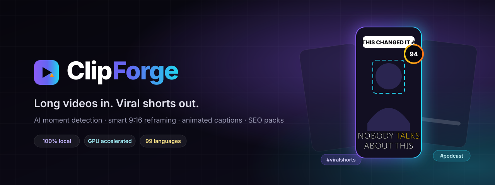

<div align="center">



<br/>

**Turn any YouTube video or upload into ranked, captioned, ready-to-post 9:16 shorts — with an SEO pack for every clip.**
An open-source, local-first alternative to Opus Clip.

<br/>


[Features](#-features) · [How it works](#-how-it-works) · [Quick start](#-quick-start) · [Roadmap](#-roadmap) · [Tech stack](#-tech-stack)

</div>

---

> [!NOTE]
> ClipForge is being built in public. The [design spec](docs/superpowers/specs/2026-10-03-shorts-generator-design.md) is complete; features land phase by phase — see the [roadmap](#-roadmap) for what works today.

## ✨ Why ClipForge

<table>
<tr>
<td width="33%" valign="top">

### 🔒 Local-first
Your videos never leave your machine. Transcription, face tracking and rendering all run on your own GPU — only transcript text goes to the LLM you choose.

</td>
<td width="33%" valign="top">

### 🧠 Bring your own AI
Pluggable brain: **Claude, Gemini, OpenAI** or fully-offline **Ollama**. Swap models per task, with automatic fallback.

</td>
<td width="33%" valign="top">

### ⚡ Fast
GPU transcription + NVENC encoding + captions burned in the same pass. Edits re-render in seconds, not minutes.

</td>
</tr>
</table>

## 🚀 Features

| | Feature | What it does |
|---|---|---|
| 🎯 | **Viral moment detection** | LLM scores every candidate on hook, emotion, novelty, value, shareability & loop potential → a **0–100 virality score** with a *why it's viral* explanation. |
| ✂️ | **Frame-accurate cuts** | The AI quotes text; ClipForge maps it to word-level timestamps and snaps to sentence ends — never a mid-word cut. |
| 🎥 | **Smart 9:16 reframing** | Five layouts picked per shot: **Track**, **Active Speaker**, **Split**, **Gaming** (facecam + gameplay) and **Fit + Blur**. Jitter-free spring camera. |
| 💬 | **Animated captions** | Word-by-word pop, karaoke fill, keyword colouring and emoji. 8 presets — Hormozi, MrBeast, Karaoke Glow, Neon & more — all customisable. |
| 🪝 | **Hook titles** | Attention-grabbing title card in the first 3 seconds, written by the AI. |
| #️⃣ | **SEO pack per clip** | Title options, platform-tuned captions for **YouTube Shorts, TikTok & Reels**, 15–30 tiered hashtags, keywords and a CTA — one-click copy. |
| 🛠️ | **Browser editor** | Trim on a waveform timeline, edit the transcript to cut video, switch styles & layouts, re-render. |
| 🎬 | **Generative polish** | Filler-word & silence removal, auto-zoom punch-ins, AI-picked B-roll, music with auto-ducking, smart thumbnails. |
| 🌍 | **Any language** | 99 languages auto-detected, translated captions and optional AI dubbing. |

## 🧩 How it works

```mermaid
flowchart LR
    A[🔗 URL / Upload] --> B[🎙️ Transcribe<br/>faster-whisper]
    B --> C[🗣️ Speakers<br/>pyannote]
    C --> D[🧠 Find moments<br/>LLM + audio peaks]
    D --> E[🎥 Reframe 9:16<br/>face & speaker tracking]
    E --> F[💬 Captions + hook]
    F --> G[🎬 Polish<br/>B-roll · music · zooms]
    G --> H[⚡ NVENC render]
    H --> I[#️⃣ SEO pack]
    style D fill:#8b5cf6,color:#fff,stroke:#8b5cf6
    style H fill:#22d3ee,color:#07060d,stroke:#22d3ee
```



Every stage is checkpointed and cached — a failed job resumes where it stopped, and re-processing the same video is instant.

## 🏁 Quick start

> Requires **Windows/Linux**, **Python 3.13**, **Node 22+**, **FFmpeg 8 (full build)** and an **NVIDIA GPU** (4 GB+ VRAM; CPU fallback supported).

```powershell
git clone https://github.com/Lunar0769/ClipForge.git
cd ClipForge
./scripts/setup.ps1        # creates venv, installs CUDA libs, downloads models, installs UI deps
./scripts/dev.ps1          # starts API + UI → http://localhost:5173
```

Then open **Settings**, add at least one LLM key (Gemini has a free tier), paste a YouTube URL and hit **Forge**.

<details>
<summary><b>🔑 Optional keys</b></summary>

| Key | Unlocks |
|---|---|
| `ANTHROPIC_API_KEY` / `GEMINI_API_KEY` / `OPENAI_API_KEY` | Moment detection, titles, SEO (one is required, or use Ollama) |
| `HF_TOKEN` | Speaker diarization for podcasts |
| `PEXELS_API_KEY` / `PIXABAY_API_KEY` | AI B-roll |
| `ELEVENLABS_API_KEY` | Premium dubbing (free Edge-TTS otherwise) |

Missing optional keys simply disable that feature — jobs never fail because of them.
</details>

## 🗺️ Roadmap

- [x] **Phase 1 — Foundation:** setup script, API + job queue, download & transcription, UI shell
- [x] **Phase 2 — Clip engine:** LLM moment scoring (0–100 virality), candidate extraction, ranked clips gallery
- [x] **Phase 3 — 9:16 Render Engine & SEO:** FFmpeg smart blurred background vertical cutting, thumbnails, inline & cinema player, platform copy (YT Shorts / TikTok / Reels)
- [x] **Phase 4 — Animated Captions & Subtitle Engine:** ASS word-by-word active karaoke pop, 4 viral presets (Hormozi, MrBeast, Cyber Neon, Minimal Clean), opening hook title badges, on-demand dashboard style switching
- [x] **Phase 5 — Batch Export & Studio Polish:** 1-click ZIP export (MP4s + subtitles + thumbnails + formatted seo.txt), synchronized studio box workbench, transcript search & copy
- [x] **Phase 6.1 — Retention Polish:** 1.08x auto-zoom punch-ins & harmonic procedural audio beds (Chill, Energetic, Suspense)
- [x] **Phase 6.2 — Studio Timeline & Trimmer:** Dual-handle video scrubber, custom start/end trim editor, live hook text re-rendering
- [x] **Phase 6.3 — Settings & Multi-Provider Hub:** Hot-swappable AI keys (Gemini, OpenAI, Anthropic, Ollama), live ping tests, hardware acceleration status
- [ ] **Phase 6.4 — Advanced Polish:** B-roll visual inserts & multilingual dubbing

## 🧰 Tech stack

<table>
<tr><td><b>Backend</b></td><td>Python 3.13 · FastAPI · SQLModel · asyncio job queue</td></tr>
<tr><td><b>AI / Media</b></td><td>faster-whisper · pyannote.audio · PySceneDetect · MediaPipe · YOLO-face (ONNX) · yt-dlp</td></tr>
<tr><td><b>Render</b></td><td>FFmpeg 8 · NVENC · libass</td></tr>
<tr><td><b>LLMs</b></td><td>Claude · Gemini · OpenAI · Ollama</td></tr>
<tr><td><b>Frontend</b></td><td>React 19 · Vite · TypeScript · Tailwind v4 · Motion · GSAP · React Three Fiber</td></tr>
</table>

## 🙏 Acknowledgements

Inspired by [Opus Clip](https://www.opus.pro/) and the open-source work of [openshorts](https://github.com/mutonby/openshorts) and [AI-Youtube-Shorts-Generator](https://github.com/Anil-matcha/AI-Youtube-Shorts-Generator).

<div align="center">
<br/>
<sub>Built with ❤️ for creators · If ClipForge helps you, drop a ⭐</sub>
</div>
